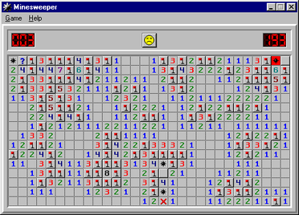

# Minesweeper-2024

> ACM 班 2024 级程序设计第一次大作业

~~大作业~~ 扫雷

## 目录

1. [Minesweeper-2024](#Minesweeper-2024)
   1. [目录](#目录)
   2. [简介](#简介)
      1. [背景](#背景)
      2. [作业目标](#作业目标)
   3. [作业要求](#作业要求)
      1. [术语解释](#术语解释)
      2. [作业任务](#作业任务)
         1. [基础任务](#基础任务)
         2. [进阶任务](#进阶任务)
      3. [数据范围](#数据范围)
   4. [须知](#须知)
      1. [截止时间](#截止时间)
      2. [如何完成程序](#如何完成程序)
         1. [仓库文件结构](#仓库文件结构)
         2. [基础任务](#基础任务-1)
         3. [进阶任务](#进阶任务-1)
      3. [提交方式](#提交方式)
      4. [评分规则](#评分规则)
         1. [A班](#a班)
         2. [B班](#b班)
   5. [Special Thanks](#Special-Thanks)

## 简介
### 背景

Minesweeper（扫雷）是经典的轻量级小游戏。作为老版本 Windows 操作系统的内置应用，它在许多人的回忆中可能是学生时代在老电脑里的娱乐，信息课上的摸鱼或是竞赛中垃圾时间的消遣。



自从 Windows 8 从内置游戏中移除了扫雷，关于扫雷的回忆可能已经随我们的那段童年一起被慢慢地尘封。那么在这里，在你初入 ACM 班的第一个大作业中，让我们来回顾一下扫雷吧～

### 作业目标

我们想通过本次作业达到以下目标：
1. 基础任务
   - 熟悉基本的输入输出与控制流语句
   - 熟悉函数的使用
   - 熟悉数组的使用
   - 熟悉函数的递归
   - 了解搜索算法（可选）
   - 边界情况的处理
   - 规范代码风格
2. 进阶任务
   - 提高模拟水平
   - 提高运用算法解决实际问题的能力
   - 使用 git 与 cmake 管理项目（可选）

## 作业要求

在本次作业中，你需要实现一个扫雷游戏（如果你不知道扫雷是什么，你可以参考 [Minesweeper](https://en.wikipedia.org/wiki/Minesweeper_(video_game)) ）。

### 术语解释
由于本次作业涉及到一些为了方便表述而使用的术语，我们会先进行解释：
- 地图，格子：在上面的游戏截图中，每一个小方块被我们称为一个格子，所有的格子构成地图
- 地雷、非地雷格子，非地雷格子的地雷计数：游戏中的格子可能是地雷或非地雷格子；若一个格子是非地雷格子，则我们将其周围八个格子中地雷的总数称为其地雷计数。
- 访问格子：在游戏最开始，所有格子都是**未被访问**的（即其内容对于用户是未知的）。用户访问一个格子相当于传统扫雷游戏中左键单击该格子，其状态变为已访问。
  - 如果访问的格子状态**已经访问或标记为雷**，不会产生任何效果。
  - **与传统扫雷游戏相同，当你访问某个地雷计数为 0 的格子时，周围的所有格子将自动被访问**。若自动被访问的格子中也有地雷计数为 0 的，该过程会继续进行下去。
  - 对于 B 班同学，你可能需要运用递归的思想解决这一问题。如果你对实现这一任务没有头绪，请咨询助教。
- 标雷：标雷类似于传统扫雷游戏右键单击操作，其状态变为已被标记。
  - 如果标记的格子状态**已经访问或标记为雷**，不会产生任何效果。**与传统的扫雷游戏不同，标记已被标记的格子不会取消地雷标记。**
- 自动探索：自动探索相当于传统扫雷游戏中左键双击操作。
  
  - 自动探索的目标仅能是**被访问的非地雷格**（也就是有数字的格子）。如果自动探索操作的目标格子**不是**已被访问的非地雷格子，该操作不会产生任何效果。
  - 如果目标格子周围八个格子中**地雷标记的总数等于其地雷计数**，访问这八个格子中所有非地雷格子（等价于手动逐个点击所有非地雷格）。
- 游戏结束条件：若一个格子是地雷，则访问该格子将**立即**导致游戏失败。**与实际的扫雷游戏不同，如果将一个非地雷格子标记为雷，游戏也会立即失败**。否则游戏继续。如果所有非地雷的格子均被访问（**不要求所有雷都被标出**），游戏胜利。

### 作业任务

#### 基础任务

在本次作业中，你的基础任务是模拟实现一个命令行交互的扫雷小游戏，即实现该游戏的服务端。

首先，你会通过标准输入得到给定地图的信息：第一行输入两个整数 `n` `m` ，代表地图有 `n` 行 `m` 列。随后 `n` 行，每行输入 `m` 个字符（不计换行符），其中第 `i` 行第 `j` 列（0-based，下同）代表地图中第 `i` 行第 `j` 个格子的内容。`.` 代表非地雷格子，`X` 代表地雷格子。

例如下面的输入
```
3 3
.X.
...
..X
```
代表当前游戏的地图大小为 3 * 3。在地图的第 0 行第 1 列与第 2 行第 2 列放置了地雷。

在初始状态下，地图中的所有格子都是未被访问的。

初始化完成后，你需要输出地图（格式见下）。随后，你会通过标准输入得到若干行字符串来表示玩家的操作，每一行有三个正整数  `x y type` 。 `x` ， `y` 是两个在 `[0, n - 1]` 和 `[0, m - 1]` 范围的整数，代表玩家这一步希望操作第 `x` 行第 `y` 列的格子。 `type` 的取值只可能 0 , 1 或 2 ，代表操作的类型： 0 表示访问格子， 1 表示标雷， 2 表示自动探索。

在读取玩家的输入后，你需要执行相应的操作，并将访问后的地图状态输出。输出格式与输入相仿，具体地

- 输出 `n` 行 `m` 列，最后输出换行符
  - 未被访问的格子输出为 `?`，例如上面的地图在初始状态下的输出应当为
      ```
      ???
      ???
      ???
      ```
      
  - 对于已被访问过的格子，若其为地雷，输出 `X`，若其不是地雷，输出一个正整数 `k`，表示其地雷计数。例如对于上面的地图，若依次访问坐标为 (2, 0) , (2, 2) 的格子，输出应当为
      ```
      ???
      12?
      01X
      ```
      （如果你不明白为什么 (1, 0) 和 (1, 1) 两个格子也被访问，请参考[术语解释](#术语解释)）
      
      此时因为访问到了地雷，游戏失败。
      
  - 对于已被标雷的格子，若其为地雷，输出为`@`，表示标雷成功；若其不是地雷，输出`X`。例如对上面的地图，若访问坐标为(2, 0)的格子，再依次标雷坐标为(2, 2), (0, 0)的格子，输出应当为
    
      ```plaintext
      X??
      12?
      01@
      ```
      
   - 为了让你更好地理解操作及其组合，我们将给出一个完整例子：
     
      假设现在只访问了坐标为 (2, 0) 的格子，输出应当为
      
      ```
      ???
      12?
      01?
      ```
      
      如果对坐标为 (1, 2) 的格子执行标雷操作，输出应当为
      
      ```
      ???
      12X
      01?
      ```
      
      此时因为把非地雷格子标记为雷，游戏失败；
      
      
      
      如果对坐标为 (2, 2) 的格子执行标雷操作，输出应当为
      
      ```
      ???
      12?
      01@
      ```
      
      此时如果再对坐标为 (2, 1) 的格子执行自动探索操作，输出应当为
      
      ```
      ???
      122
      01@
      ```
      
   - 当所有非地雷格子已被访问后（即游戏胜利前最后一次输出地图时），你需要将在所有为地雷的格子处输出 `@` （**无论被标记与否**）；非地雷格子同上。例如，对于上面的地图，游戏胜利前最后一次输出应当为
  
      ```
      1@1
      122
      01@
      ```
  
- 输出地图后，你需要判定游戏是否结束（失败或胜利）。若游戏结束，你应当先输出一行文字，**若胜利则为 "YOU WIN!"，若失败则为 "GAME OVER!"**。再输出一行两个整数 `visit_count marked_mine_count`，以空格分隔。 `visit_count` 表示玩家访问过的**非地雷格子**个数， `marked_mine_count` 表示判定正确的地雷格子个数（若游戏胜利，则为总地雷格子的个数；若游戏失败，则为**标记正确**的地雷格子个数）。随后立即以 0 为返回值退出程序。
   - 例如，在上面的地图中，如果游戏获胜，最后应该输出以下信息并退出程序：
      ```
      YOU WIN!
      7 2
      ```

#### 进阶任务

在本次作业中，你的进阶任务是游玩你刚刚设计的扫雷小游戏，即实现该游戏的用户端。这一任务是为 A 班同学准备的。你可以将其类比为算法竞赛中的交互题。有所不同的是，我们这里不使用标准输入输出进行交互，而是通过你刚刚自己写的游戏程序交互。

我们下面将游戏程序称为服务端代码（即 `server.h`），游玩程序称为用户端代码（即 `client.h`）。

首先，我们将读入游戏地图作为服务端代码的输入，用户端代码仅可以获知游戏地图的行数与列数。接下来，用户端代码不断发起 `Execute(row, column, type)` 指令（第一次将由输入数据代你发出，防止第一次就踩雷），即访问某一个方块并获得该访问后的地图情况。具体地，`Execute(row, column, type)` 函数的实现形如
```
Execute(row, column, type):
  VisitBlock(row, column) or MarkMine(row, column) or AutoExplore(row, column)
  ReadMap() from result of PrintMap()
```
因此，如你所见，你需要在 ReadMap 函数中读取有限的地图信息，并储存到一些全局变量中，随后根据这些地图信息做出下一步的决策，通过 `Execute` 再次发起决策。具体的代码结构逻辑可以参考 `advanced.cpp` 和 `client.cpp` 。如果你不明白代码的实现方式，请立即询问助教！！！

例如，若输入数据为
```
3 3
.X.
...
..X
2 0
```
最下面一行 `2 0` 是输入数据代你做出的第一次决策，下面给出了一组交互的例子。

```
Decision                result of PrintMap
2 0 0                   ???
                        12?
                        01?
1 2 0
                        ???
                        122
                        01?
0 1 0
                        ?X?
                        122
                        01?
                        GAME OVER!
                        5 0
```

最后两行是游戏结束（失败）的输出。

整个游戏的调用流程应该是这样的：

- 开始游戏时，`main()`函数调用`InitMap()`函数来初始化地图。
- 然后，在游戏结束前，游戏会反复进行如下操作：
  - 调用`Decide()`，让你的程序自行决定该选哪个格子，进行何种操作。
  - 当你的程序决定了格子和操作之后，`Decide()`将调用`Execute(row, column, type)`，这个函数会使用你自己的的`server`刷新地图，并调用`ReadMap()`，将`server`更新的地图输出给`ReadMap()`
  - `ReadMap()`从标准输入读入新的地图。

如果你对程序的运行流程依然不是很理解，可以随时咨询助教

### 数据范围

地图的行数 `n` 、列数 `m` 、地雷数 `x` 满足： $1<n, m \le 30$ ， $1\le x<mn$ 。对于基础任务，操作序列长度不大于 $1000$ ，且所有操作保证合法。对于进阶任务，保证第一次操作一定不会访问地雷格子。保证所有输入合法。

## 须知

### 截止时间

第四周周日（10/13）24:00

### 如何完成程序

你有两种方式下载该仓库完成作业：

1. 在 GitHub 页面点击 Code - Download ZIP，仓库代码将会被下载到本地，随后你可以直接在本地仓库上进行编辑。
2. 若你掌握 Git 的使用，你可以 clone 该仓库进行操作，或者以该仓库为 Template 创建自己的仓库，在自己的仓库中进行操作（我们推荐使用最后一种操作方式）。

#### 仓库文件结构

```
├── CMakeLists.txt
├── LICENSE
├── README.md
├── src
│   ├── CMakeLists.txt
│   ├── advanced.cpp
│   ├── include
│   │   ├── client.h
│   │   └── server.h
│   └── basic.cpp
└── testcases
    ├── advanced
    └── basic
```

#### 基础任务

对于基础任务，你的程序主文件是 `basic.cpp`，其内容无需更改，你只需要阅读并理解该程序是如何调用 `server.h` 中的函数的。在此基础上，你需要实现 `server.h` 中标记 `TODO` 的函数，并通过运行 `basic.cpp` 来测试你的程序。在 `testcases/basic` 文件夹中，有 6 个公开数据点供你完成调试（测试点 `11` - `13` 是 Minesweeper-2023 的旧测试点，只包含访问格子操作；测试点 `1` 和 `2` 包含所有操作；测试点 `7` 是鲁棒性测试点）。更详细地，以测试点 `1` 为例，请将 `1.in` 输入你的程序，你的输出应当与 `1.out` 相同。

若你使用 Visual Studio Code ，可点击最下方工具栏的 Build 与运行按钮（目标选择 server ）来编译运行你的程序。

若你使用 CLion ，可直接用上方工具栏编译运行 server 目标。

注意，你必须在 IDE 中直接以项目文件夹（即包含该 README 的文件夹）为工作目录打开该项目，否则无法使用以上方式编译运行。

#### 进阶任务

对于进阶任务，你的程序主文件是 `advanced.cpp`，其内容无需更改，你只需要阅读并理解该程序是如何调用 `server.h` 与 `client.h` 中的函数的。在完成基础任务之后，你需要实现 `client.h` 中标记 `TODO` 的函数，并通过运行 `advanced.cpp` 来测试你的程序。在 `testcases/advanced` 文件夹中，有 5 个公开数据点供你完成测试。更详细地，以 `advanced1` 测试点为例，请将 `advanced1.in` 输入你的程序，并等待程序的输出。

若你使用 Visual Studio Code ，可点击最下方工具栏的 Build 与运行按钮（目标选择 client ）来编译运行你的程序。

若你使用 CLion ，可直接用上方工具栏编译运行 client 目标。

### 提交方式

请在 OnlineJudge 上直接提交你完成的头文件。对于基础任务，提交 `server.h` 。对于进阶任务，提交 `client.h` 。

### 评分规则

项目理论上的总分是115%，但是你的得分上限为 110%（如果>110%则取110%），溢出分数直接算入期末总评。

#### Advanced评分准则

##### 写在前面

若游戏结束时，你扫出来的雷数量为 $p$ ，访问的格子数量为 $q$ ，总的格子数为 $n\times m$ ，那么你的成绩将为 $\frac{p+q}{nm}\times 100\%$ 。

为了降低随机的成分，我们会实现一个随机地图生成器。每一组测试中，生成 $50$ 张随机地图，利用你的 `client.h` 和助教写的 `server.h` 进行测试（**评测类似于 `advanced.cpp` 中的 `TestBatch()` ，会多次调用 `InitGame()` 。因此，在编写 `InitGame()` 函数时，请务必将所有你自定义的全局变量初始化**），在去掉最低10%的成绩后，取平均值作为这组数据的成绩。这会导致较长的测评时间，**求不虐萌萌哒评测机，求不虐萌萌哒服务器QAQ**。

我们鼓励你尝试微小的程序变化带来的优化，但是**严禁反复交同一发随机代码很多次的行为**。我们会实时关注题目的提交情况。

##### 关于Baselines

助教会提交3份baseline代码作为各位评分的依据。如果你打败了某个baseline，你将获得击败他的全分；如果你介于某两个baseline之间，那么你获得的分数**将不低于线性**，且从原始分到实际成绩的映射是保序的。例如你是A班的同学，`baseline 1`是 $70000$ 分，`baseline 2`是 $80000$ 分，你获得了 $75000$ 分，那么你将在Advanced任务中获得至少 10%（击败 `baseline1` 的得分）+ 10%（ `baseline1` 到 `baseline2` 区间的得分）的成绩。

- `Rubbish Baseline`：最弱的一个扫雷客户端，是评分的起评线。对于A班的同学，低于Rubbish将**不给分**；对于B班的同学，低于或接近Rubbish我们将酌情给分。
  - 强度：只会乱点。~~只要是灵长类动物应该都能吊打~~

- `Baseline1`：有一定基础推理能力的Baseline。具体的评分准则详见下面。

  - 强度：能够推断出所有比较显然的情形。
    - 自动地auto-explore以探索明显可以被打开的格子
    - 如果一个被访问的非地雷格周围有 $k$ 个未知格，且这一格的数字也是 $k$ ，能自动地给它周围的所有未知格标雷。
  - 对于需要一些逻辑推理能力的局势，有**较弱的推理能力**

- `baseline2`：有比较强推理能力的Baseline。具体评分准则详见下面。
  - 强度：能够推断出所有比较显然的情形。
  - 对于需要一些推理能力的局势，有**较强推理能力**

##### 关于下发数据

由于数据是随机批量生成的，我们会将**地图生成器**和**部分数据的参数**（随机种子&地图参数）进行下发以供各位进行测试。同时，我们会下发部分**测试集中的单个数据**，以便于你调试。

##### 关于评分机制及其调整

由于新的评分机制是第一次实施，如果你认为评分机制有不合理之处， advanced 部分时限过短或者一些其他改进建议，可以私信本次大作业的负责助教@xiaoh（胡瑞岩）/@bubble（王思瀚）提出。我们会认真考虑各位的意见。

#### A班

- 基础任务 60%
  - 按 OJ 得分给分
- 进阶任务 35%
  - `Rubbish`-`Baseline1` 20%
  - `Baseline1`-`Baseline2` 10%
  - `Beat Baseline2` 5%
- Code Review 20%

#### B班

- 基础任务 80%
  - 按 OJ 得分给分
- 进阶任务 15%
  - `Rubbish`-`Baseline1` 10%
  - `Baseline1`-`Baseline2` 5%
- Code Review 20%

## Special Thanks

本次作业改编自 2023 程序设计的第一次大作业 Minesweeper-2023 。

感谢 22' ACM Conless, 22' ACM Arcadia 提供的 Idea 和代码框架~
